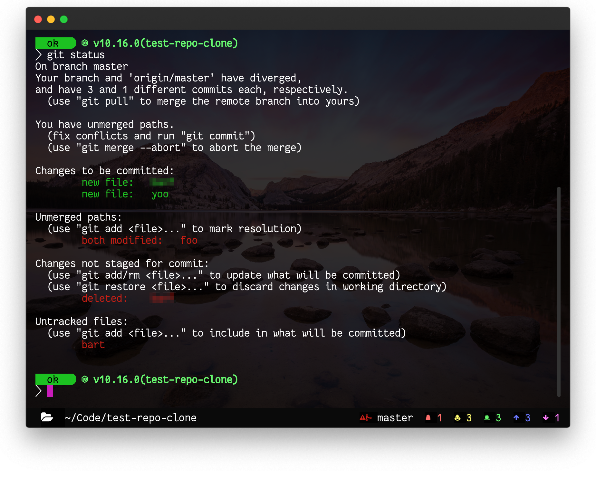

# hyper-statusline [](https://github.com/zeit/hyper/releases/tag/1.3.3) [](https://www.npmjs.com/package/hyper-statusline) [](https://www.npmjs.com/package/hyper-statusline)

> Status Line Plugin for [Hyper](https://hyper.is). Shows clickable & useful information. Matches any theme.



Displays:
  * CWD
  * Git branch
  * Red branch icon when merging
  * Number of untracked files
  * Number of dirty files
  * Number of staged files
  * Number of commits ahead of origin
  * Number of commits behind origin

Uses icons from [Nerd Fonts](https://www.nerdfonts.com)

## Install

Add following to your `~/.hyper.js` config.

```javascript
module.exports = {
  ...
  plugins: ['hyper-statusline']
  ...
}
```


## Config

Add following to `~/.hyper.js`

### Change Git Untracked Color
Expected value is `CSS color`

```javascript
module.exports = {
  config: {
    ...
      hyperStatusLine: {
        untrackedColor: 'chartreuse',
      }
    ...
  }
}
```

### Change Git Dirty Color
Expected value is `CSS color`

```javascript
module.exports = {
  config: {
    ...
      hyperStatusLine: {
        dirtyColor: 'salmon',
      }
    ...
  }
}
```

### Change Git Staged Color
Expected value is `CSS color`

```javascript
module.exports = {
  config: {
    ...
      hyperStatusLine: {
        stagedColor: 'cornflowerblue',
      }
    ...
  }
}
```

### Change Git Ahead Color
Expected value is `CSS color`

```javascript
module.exports = {
  config: {
    ...
      hyperStatusLine: {
        aheadColor: 'ivory',
      }
    ...
  }
}
```

### Change Git Behind Color
Expected value is `CSS color`

```javascript
module.exports = {
  config: {
    ...
      hyperStatusLine: {
        behindColor: 'peachpuff',
      }
    ...
  }
}
```

### Disable Footer Transparency
Default value is set to `true`

```javascript
module.exports = {
  config: {
    ...
      hyperStatusLine: {
        footerTransparent: false,
      }
    ...
  }
}
```

## License

MIT © Henrik
